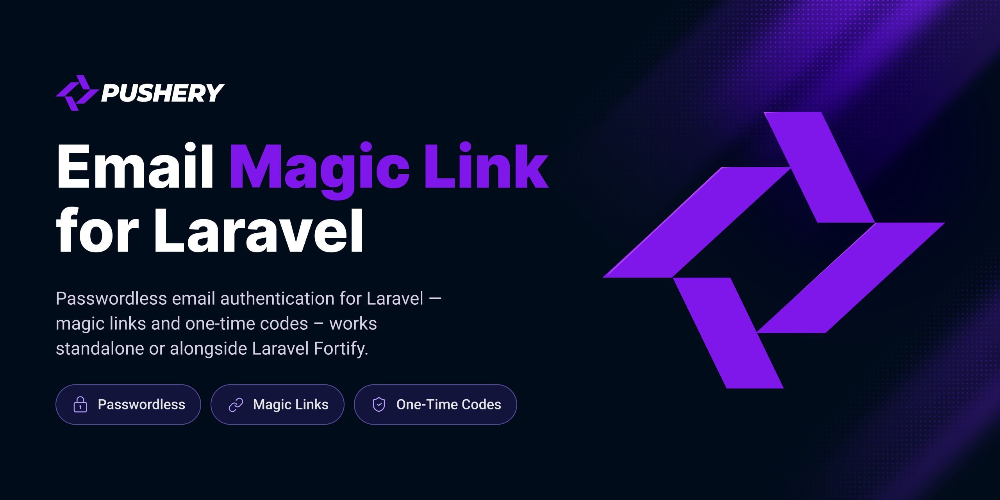

<p align="center">
  <a href="https://github.com/pushery/email-magic-link-for-laravel">
    
  </a>
</p>

# Email Magic Link for Laravel

[](https://packagist.org/packages/pushery/email-magic-link-for-laravel)
[](https://packagist.org/packages/pushery/email-magic-link-for-laravel)
[](https://phpstan.org/)
[](https://laravel.com/docs/pint)
[](https://packagist.org/packages/pushery/email-magic-link-for-laravel)

Passwordless email authentication for Laravel — magic links and one-time codes — that works **standalone** or alongside **Laravel Fortify**.

Plenty of packages send a magic link. This one is built around two properties most of them get wrong:

### 1. A correct, no-bypass Fortify two-factor handoff

If a user has confirmed TOTP through Fortify, clicking a magic link does **not** log them in. Instead they are handed off to Fortify's own two-factor challenge in a not-yet-authenticated state, and the login only completes inside Fortify after the code is verified. There is no path that signs a two-factor user in without the second factor — and an end-to-end test runs the real Fortify challenge to keep it that way across Fortify upgrades.

### 2. Scanner-safe and prefetch-safe link consumption

The emailed link is a `GET` that **only renders a confirmation page** — it performs no authentication and no state change. The single-use token is consumed solely by an explicit `POST` from that page. Corporate email security scanners (Microsoft SafeLinks, Mimecast, Proofpoint) and browser prefetch follow the `GET` and cannot burn the link before the human clicks "Sign in".

---

## Requirements

| Component | Constraint |
|---|---|
| PHP | `^8.4` (8.4 and 8.5) |
| Laravel | `^13.0` |
| Laravel Fortify | `^1.0` — optional, only for the two-factor handoff |

The package requires `laravel/framework` (for the `FormRequest` base it validates with) and adds no third-party runtime dependencies. Fortify is a **suggested** dependency; the core never references a Fortify symbol unless Fortify is installed and the bridge is enabled.

## Installation

```bash
composer require pushery/email-magic-link-for-laravel
```

Then run the installer to publish the configuration and print the next steps:

```bash
php artisan email-magic-link:install
```

Add `--views` to also publish the Blade views. The migration is loaded automatically, so a fresh app works without publishing anything.

Prefer to do it by hand? The individual publish tags are still available:

```bash
php artisan vendor:publish --tag=email-magic-link-config
php artisan vendor:publish --tag=email-magic-link-migrations
php artisan vendor:publish --tag=email-magic-link-views
```

## Quick start

Out of the box the package registers a complete browser flow under the `web` middleware group:

| Method | URI | Name | Purpose |
|---|---|---|---|
| `GET` | `/magic-link` | `email-magic-link.request.form` | "Enter your email" form |
| `POST` | `/magic-link` | `email-magic-link.request` | Issue a link or code |
| `GET` | `/magic-link/verify/{token}` | `email-magic-link.confirm` | Inert, signed confirmation page |
| `POST` | `/magic-link/verify/{token}` | `email-magic-link.consume` | Consume a magic link |
| `GET` | `/magic-link/code` | `email-magic-link.code.form` | Enter a one-time code |
| `POST` | `/magic-link/code` | `email-magic-link.code.consume` | Consume a one-time code |

Point your "log in" link at `route('email-magic-link.request.form')` and you have passwordless login. A user enters their email, receives a link, clicks it, confirms, and is signed in.

## Issuing links and codes yourself

Sometimes you want to deliver the link or code over a channel the bundled email flow does not cover — an SMS, a chat message, an existing transactional email, or a queued job. The **Mint-API** issues a credential and hands it back **without sending anything**:

```php
use EmailMagicLink\Facades\EmailMagicLink;

// A single-use magic link for the default guard.
$link = EmailMagicLink::issueLink($user);
$link->url;              // signed, single-use confirmation URL — deliver this verbatim
$link->expiresAt;        // Illuminate\Support\Carbon
$link->expiresInMinutes; // e.g. 15 — handy for your own copy

// A one-time code instead.
$code = EmailMagicLink::issueCode($user);
$code->code;             // the code to deliver
$code->expiresAt;
$code->expiresInMinutes;
```

Prefer dependency injection? Depend on the `EmailMagicLink\Contracts\MagicLinkIssuer` contract; the facade is a thin wrapper over it.

```php
use EmailMagicLink\Contracts\MagicLinkIssuer;

public function __construct(private MagicLinkIssuer $issuer) {}
```

The minted credential is hashed at rest, single-use, and consumed through the exact same flow as an emailed one — only nothing is sent. A few rules the API enforces or expects:

- **Deliver `url` verbatim.** It points at the inert, signed confirmation page (a `GET` that changes nothing); the token is spent only when the user submits it. Never send or prefetch the consume endpoint.
- **Pass a user that belongs to the guard.** Issuing re-resolves the user through the guard's own provider — the same provider the consume step uses — and throws `UserNotInGuardException` if it does not match. With no `$guard` the default guard is used; pass an allowed guard (the default plus any under `guards`) or get an `UnknownGuardException`.
- **`issueCode` supersedes the previous code** for the same user and guard, so only the most recently issued code can be claimed. (`issueLink` does not invalidate earlier links.)
- **The channel must be enabled.** With `enabled = false` the API throws `MagicLinkDisabledException` rather than minting a credential that could never be consumed.
- Need to look a user up by email first? Inject `EmailMagicLink\Contracts\UserLookup` — that is the supported email-to-user path; the Mint-API deliberately takes an already-resolved user.

## The three configurations

**Standalone — no Fortify.** A verified user is logged in directly with `Auth::login`. There is no second factor in standalone mode, by design.

**With Fortify, bridge on (`fortify.mode = 'auto'`, the default).** A user with confirmed TOTP is routed through Fortify's challenge; everyone else logs in directly.

**With Fortify, bridge off (`fortify.mode = false`).** Fortify can be installed for other flows while the magic-link channel ignores it entirely and logs users in directly.

The channel itself can be turned off completely with `enabled = false`, independent of whether Fortify is installed.

## Why a magic link costs one extra click

Because consumption is `POST`-only, the user clicks the emailed link (a `GET`) and then clicks "Sign in" on the confirmation page. That second click is the price of being safe against link-following security scanners and prefetch — tools that would otherwise spend a single-use token before the person ever sees it. We consider that trade-off worth it; it is the whole point of the package.

For first-party SPA or mobile clients that exchange the token over JSON without an interstitial, set `api.enabled = true` and send `Accept: application/json`. The endpoints then speak a stable JSON contract:

| Outcome | Status | Body |
| --- | --- | --- |
| Link / code requested | `200` | `{ "message": "…", "channel": "link"\|"code" }` |
| Signed in | `200` | `{ "authenticated": true, "two_factor": false, "redirect": "<url>" }` |
| Two-factor required | `200` | `{ "authenticated": false, "two_factor": true, "redirect": "<challenge url>" }` |
| Invalid or expired | `422` | `{ "message": "…", "error": "invalid_or_expired" }` |
| Validation failed | `422` | `{ "message": "…", "errors": { … } }` |
| Rate limited | `429` | `{ "message": "…" }` + `Retry-After` / `X-RateLimit-*` headers |

The `error` code is stable and safe to branch on, while the human `message` stays generic so it never reveals whether an account exists. A `two_factor` response means the client must send the user to `redirect` to finish the TOTP challenge — the second factor is never skipped.

## The two-factor handoff (and its trade-off)

When the bridge is active and a verified user has **confirmed** two-factor authentication (gated on `two_factor_confirmed_at`, not merely a stored secret, so a user mid-setup is never locked out):

1. The token is consumed.
2. Fortify's `login.id` session key is set and the request is redirected to Fortify's `two-factor.login` challenge — **without** logging the user in.
3. The login completes inside Fortify only after the TOTP code passes.

**Trade-off:** the token is already spent when the handoff happens, so if a user abandons the TOTP step they must request a fresh link. This is intentional — the link is single-use and the challenge is a separate, deliberate step.

**Guard alignment:** when the handoff is enabled, `email-magic-link.guard` must resolve to the same provider as `fortify.guard`, because Fortify re-resolves the challenged user from its own guard's provider. With mismatched providers the challenge fails closed (the user cannot complete login) rather than logging anyone in. The default `web` guard satisfies this out of the box.

`fortify.respect_two_factor = false` disables this handoff. **This is a security downgrade: magic-link logins will skip two-factor for users who have it enabled.** It emits a warning at boot.

## Configuration

All values live in `config/email-magic-link.php`.

| Key | Default | Purpose |
|---|---|---|
| `enabled` | `true` | Master switch for the channel (routes, notifications, limiters). |
| `mode` | `'link'` | `'link'`, `'code'`, or `'both'`. |
| `ttl` | `900` | Default token lifetime in seconds. |
| `link_ttl` | `null` | Link lifetime in seconds; inherits `ttl` when unset. |
| `code_ttl` | `null` | Code lifetime in seconds; inherits `ttl` when unset (handy for a shorter, hand-typed code). |
| `code_length` | `8` | One-time code length. |
| `code_alphabet` | unambiguous A–Z/2–9 | Alphabet for codes (governs keyspace). |
| `max_attempts_per_token` | `5` | Hard per-token lockout for code mode. |
| `entropy_safety_factor` | `1_000_000` | Guardrail bar; cannot be lowered below this floor. |
| `guard` | app default | Default stateful guard to log into. |
| `guards` | `[]` | Extra guards a request may select via a `guard` field. |
| `user_lookup` | bundled | `UserLookup` implementation. |
| `token_store` | bundled | `TokenStore` implementation. |
| `notification` | `MagicLinkNotification` | Notification class (extend it to customize). |
| `routes.prefix` | `''` | Route prefix. |
| `routes.middleware` | `['web']` | Route middleware (sessions + CSRF). |
| `routes.redirect_to` | `'/'` | Fallback redirect after login. |
| `routes.intended` | `true` | Return to the originally requested URL after login. |
| `api.enabled` | `false` | Direct JSON token exchange for SPA/mobile. |
| `ui.mode` | `'auto'` | `'auto'` (WireKit views if installed) or `'blade'`. |
| `ui.vite` | `['resources/css/app.css']` | Vite entry the WireKit layout loads. |
| `fortify.mode` | `'auto'` | `'auto'` (on if Fortify present), `true`, or `false`. |
| `fortify.respect_two_factor` | `true` | Route confirmed-2FA users through the challenge. |
| `fortify.challenge_route` | `'two-factor.login'` | Fortify challenge route name. |
| `limiters.request` / `limiters.consume` | named limiters | Override with `RateLimiter::for()`. |
| `limits.request` / `limits.consume` | `5` / `10` per minute | Defaults for the bundled limiters. |

## One-time codes

Set `mode` to `'code'` (or `'both'`) to email a short code instead of a link. Codes are governed by a **boot-time entropy guardrail**: the package refuses to boot if a code's keyspace divided by its attempt lockout falls below `entropy_safety_factor`, naming the exact keys to fix and the minimum length that would pass. Magic links carry 256 bits of entropy and pass trivially.

In `'both'` mode the request endpoint issues a link by default, or a code when `channel=code` is submitted.

## Cleaning up tokens

Every request inserts a row, and consumption only marks it consumed. Schedule the bundled command to delete expired and consumed tokens so the table stays small:

```php
use Illuminate\Support\Facades\Schedule;

Schedule::command('email-magic-link:purge')->daily();
```

## Translations

Every user-facing string — the views, the notification, and the status and error
responses (the "we sent a link", "invalid or expired", and challenge-failed
messages) — runs through Laravel's translator under the `email-magic-link`
namespace, so everything follows the application's active locale. English, German,
Spanish, French, Italian, Dutch, and Portuguese ship in the box, along with the
regional variants `en-GB`, `en-US`, `pt-PT`, and `pt-BR` — copies of the `en` and
`pt` messages, ready for regional refinement — so an app that distinguishes them
renders fully localized screens and emails with no fallback. Publish the language
files to translate, reword, or add more:

```bash
php artisan vendor:publish --tag=email-magic-link-lang
```

That copies the strings to `lang/vendor/email-magic-link/{locale}`. Add a locale
by copying the `en` directory (for example to `de`) and translating the values;
the `:app` and `:minutes` placeholders are filled in at render time.

## Multiple guards

By default everything runs through the configured `guard`. To let a request sign
in to another guard — say an `admin` guard alongside `web` — list it in `guards`
and submit a `guard` field from your sign-in form:

```php
'guard' => 'web',
'guards' => ['admin'],
```

```blade
<input type="hidden" name="guard" value="admin">
```

The request issues the token for the selected guard, the user is resolved through
**that guard's** user provider, and login completes on it. A guard not on the
allowlist falls back silently to the default, so guards stay un-enumerable.

> Security: only list guards whose user provider you are happy to expose to
> self-service magic-link login. A user found in a guard's provider can sign in to
> that guard, so guards that share a provider also share access. When the Fortify
> two-factor handoff is active, the selected guard should match `fortify.guard`.

## WireKit

If [WireKit](https://wirekit.app) (`pushery/wirekit`) is installed, the sign-in
screens render with WireKit components automatically — no configuration needed.
Without it, the package serves its own dependency-free Blade views, so it works
either way. Set `ui.mode` to `blade` to keep the plain views even when WireKit is
present.

WireKit renders with design-token CSS variables, Tailwind utility classes, and
Alpine directives, so its views ship inside a layout that wires all three:

- **Design tokens** — the layout injects WireKit's `@wirekitStyles`, which serves
  WireKit's own `dist/wirekit.css` (the `--color-wk-*`, `--padding-wk-*`, … tokens
  every component reads). This needs no build step and no `vendor:publish`; it is
  what keeps the screens from rendering unstyled.
- **Utility classes** — the arbitrary-value utilities WireKit emits
  (`bg-[var(--color-wk-bg-elevated)]`, …) are generated by *your* Tailwind build,
  so point it at WireKit's views in `resources/css/app.css`:
  `@source '../../vendor/pushery/wirekit/resources/views/**/*.blade.php';`. The
  layout loads your compiled stylesheet via `@vite` (configurable with `ui.vite`,
  default `resources/css/app.css`; set it `false` for a non-Vite host) and/or the
  plain `<link>` URLs listed in `ui.styles`.
- **Behavior** — `@livewireScripts` and `@wirekitScripts` bring in Alpine.

The flow itself is unchanged — the same signed routes, CSRF-protected POSTs, and
single-use token consumption — only the look differs. The bundled WireKit screens
are covered by a real-browser suite that renders each one at desktop and mobile
widths and asserts it is genuinely styled, not merely that the text is present.

## Extension points

**Take over the post-verification flow** by rebinding the authenticator contract:

```php
use EmailMagicLink\Contracts\MagicLinkAuthenticator;

$this->app->bind(MagicLinkAuthenticator::class, MyAuthenticator::class);
```

The contract returns a response, so it — not an event — is where login-versus-2FA is decided.

**React to events** (observability only — they must not drive flow control):

- `MagicLinkRequested($user, $channel, $request)` — a link or code was issued for a known user.
- `MagicLinkVerified($user, $request)` — a token was verified and consumed, before the authenticator runs.
- `MagicLinkAuthenticated($user, $guard, $request)` — the user was actually logged in (fires only on a completed login, never for a two-factor hand-off), the precise signal for an audit log.
- `MagicLinkConsumptionFailed($reason, $request)` — a consume attempt failed; `$reason` is a `ClaimFailure` (`NotFound`, `Expired`, `InvalidCode`, `LockedOut`, `AlreadyConsumed`), so you can log every failure and alert specifically on `LockedOut` (a brute-force lockout) or repeated `InvalidCode`.
- `TwoFactorChallengeRequired($user, $request)` (fired by the bridge) — a confirmed-2FA user is being handed to the challenge.

Each carries the `Request`, so a listener can record the IP and user agent. The response stays generic and enumeration-resistant regardless of which failure reason fired. Successful logins also fire Laravel's own `Illuminate\Auth\Events\Login`.

**Swap collaborators** via config: the `notification` class (extend `MagicLinkNotification`), a `UserLookup` (resolve users your way), a `TokenStore` (custom persistence), and a `CaptchaGuard` (a pre-issue challenge).

**Gate requests with a CAPTCHA.** Point the `captcha` config at a class implementing `EmailMagicLink\Contracts\CaptchaGuard`:

```php
final class TurnstileGuard implements CaptchaGuard
{
    public function passes(Request $request): bool
    {
        // Verify the challenge token (e.g. cf-turnstile-response) with the provider.
        return Http::asForm()->post('https://challenges.cloudflare.com/turnstile/v0/siteverify', [
            'secret' => config('services.turnstile.secret'),
            'response' => $request->input('cf-turnstile-response'),
        ])->json('success') === true;
    }
}
```

It runs before any user lookup, so a failed challenge rejects the request identically whether or not the email exists — it can never become an enumeration oracle. A failure returns the `captcha_failed` JSON error (or a form error) and issues nothing.

## Security model

The package is designed to fail closed. Each row below is a concrete threat and the design decision that addresses it — every one is exercised by the test suite.

| Threat | How the package addresses it |
|---|---|
| **Database leak** — a stolen backup, an exposed read replica, or SQL injection elsewhere in the app | Tokens and codes are **never stored in the clear**: only a keyed HMAC-SHA256 hash is persisted and indexed. A leaked database alone cannot recognise or forge a working link or code. |
| **Email security scanners and prefetch** — SafeLinks, Mimecast, Proofpoint, browser preconnect | The emailed `GET` is signed and **inert** — it only renders a confirmation page, with no authentication or state change. The single-use token is spent solely by an explicit `POST`, so a link-follower cannot burn it before the human clicks "Sign in". |
| **Token replay, double-spend, and races** | Consumption is a **single race-free conditional claim** (PostgreSQL `RETURNING`, with a portable affected-rows fallback), so two concurrent requests for the same token can never both succeed. Links and codes are single-use. |
| **Object injection / deserialization gadgets** | The package **never serializes objects** into a token. A row holds only scalar columns (user id, guard, channel, a hash, timestamps), so there is no `unserialize()` on any code path and therefore no object-injection surface. |
| **Account enumeration** | The request endpoint returns a response **identical** whether or not the email belongs to a user, runs the optional CAPTCHA *before* any lookup, and queues the mail so response timing does not leak existence. Consume failures collapse to a single generic message. |
| **Two-factor bypass** | A user with confirmed TOTP is handed to Fortify's challenge **without being logged in** — there is no path that authenticates a two-factor user without the second factor (see [the two-factor handoff](#the-two-factor-handoff-and-its-trade-off)). |
| **Brute force of one-time codes** | A boot-time **entropy guardrail** refuses to start when a code's keyspace divided by the per-token attempt cap is too low; a per-token lockout burns the token after too many wrong guesses; and the endpoints are rate-limited per email, per IP, and per token hash. |
| **Session fixation** | The session id is regenerated on a successful login. |

Raw tokens and full link URLs are never logged. Throttled responses carry the standard `Retry-After` and `X-RateLimit-*` headers, so API and SPA clients can back off correctly. For high-risk deployments, layer a CAPTCHA or challenge widget on top via the `captcha` guard (see [Extension points](#extension-points)).

See [SECURITY.md](SECURITY.md) for the supported versions and how to report a vulnerability.

## Built by Pushery

This package is built and maintained by [Pushery](https://www.pushery.com) — a Berlin-based studio building Laravel applications, SaaS products, and open-source tools.

Want these sign-in screens to match a polished component library out of the box? They render automatically with [WireKit](https://wirekit.app), Pushery's open-source Livewire UI kit. Browse the rest of our work at [pushery.com](https://www.pushery.com).

## Versioning

This package follows [Semantic Versioning](https://semver.org). It is in its `0.x` line while the public API settles; the backward-compatibility promise begins at `1.0.0`.

## License

The MIT License. See [LICENSE](LICENSE).
