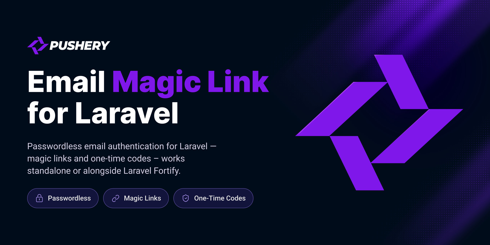

<p align="center">
  <a href="https://github.com/pushery/email-magic-link-for-laravel">
    
  </a>
</p>

# Email Magic Link for Laravel

[](https://packagist.org/packages/pushery/email-magic-link-for-laravel)
[](https://packagist.org/packages/pushery/email-magic-link-for-laravel)
[](https://packagist.org/packages/pushery/email-magic-link-for-laravel)
[](LICENSE)

[](https://pestphp.com)


[](https://phpstan.org)
[](https://laravel.com/docs/pint)


Passwordless email authentication for Laravel — magic links and one-time codes — that works **standalone** or alongside **Laravel Fortify**.

Plenty of packages send a magic link. This one is built around two properties most of them get wrong:

- **A correct, no-bypass Fortify two-factor handoff.** A user with confirmed TOTP is handed to Fortify's own challenge in a not-yet-authenticated state; the login completes inside Fortify only after the code is verified. There is no path that signs a two-factor user in without the second factor.
- **Scanner-safe and prefetch-safe link consumption.** The emailed link is a signed, inert `GET` that only renders a confirmation page. The single-use token is spent solely by an explicit `POST`, so SafeLinks, Mimecast, Proofpoint and browser prefetch cannot burn the link before the human clicks "Sign in".

## Installation

```bash
composer require pushery/email-magic-link-for-laravel
```

Requires PHP `^8.4` and Laravel `^13.0`. Laravel Fortify (`^1.0`) is optional and only needed for the two-factor handoff. There are no third-party runtime dependencies.

## Documentation

**Full docs at [docs.pushery.com/email-magic-link-for-laravel](https://docs.pushery.com/email-magic-link-for-laravel/)**

- [Installation](https://docs.pushery.com/email-magic-link-for-laravel/installation) — the installer, the migration, the publish tags, and the queue worker the emails need
- [Quick start](https://docs.pushery.com/email-magic-link-for-laravel/quick-start) — the routes you get out of the box and the flow a user walks through
- [Configuration](https://docs.pushery.com/email-magic-link-for-laravel/configuration) — the three Fortify setups, token lifetimes, and the invalid-link response
- [Minting links and codes yourself](https://docs.pushery.com/email-magic-link-for-laravel/features/issuing-links-and-codes) — deliver a credential over SMS, chat, or your own transactional email
- [Security model](https://docs.pushery.com/email-magic-link-for-laravel/security-model) — every threat the package is designed against and the decision that addresses it

## What it does

- **Magic links and one-time codes** — pick either, or offer both.
- **A complete browser flow out of the box** — six routes, the screens, and the emails; point your "log in" link at one route name.
- **A Mint API** — issue a signed link or a code and get it back without sending anything, to deliver over any channel you like.
- **Bounded multi-use links** — hand out a link redeemable N times, with the counter decremented in the same conditional `UPDATE` that consumes it, so concurrent redemptions can never exceed the limit.
- **Passphrase-gated links** — require a shared secret, delivered out of band, before a high-value link is consumed.
- **A resend guard** — an escalating cooldown plus a rolling hourly cap, so a repeatedly clicked "send again" cannot flood an inbox. Reusable for your own endpoints.
- **Invitations** — the other half of the story. A magic link can only sign in somebody who already exists; an invitation puts an account *into service* for an address that has none yet. The package issues the token, supersedes the previous one when you re-invite, refuses every dead one identically, and spends it exactly once — your application decides what accepting one means.
- **A JSON contract** — stable statuses and error codes for first-party SPA and mobile clients.
- **Multiple guards** — sign in to an `admin` guard alongside `web`, on an allowlist that keeps guards un-enumerable.
- **Eleven bundled locales** — English, German, Spanish, French, Italian, Dutch and Portuguese, plus the `en-GB`, `en-US`, `pt-PT` and `pt-BR` regional variants.
- **Styled screens, or none of ours** — the sign-in views render with [WireKit](https://wirekit.app) when it is installed, fall back to dependency-free Blade when it is not, and can be published and rewritten either way.
- **Designed to fail closed** — tokens hashed at rest, nothing serialized into a token, a single race-free conditional claim, and responses that never reveal whether an account exists.

## Built by PUSHERY

This package is built and maintained by [PUSHERY](https://www.pushery.com) — a Berlin-based studio building Laravel applications, SaaS products, and open-source tools.

Want these sign-in screens to match a polished component library out of the box? They render automatically with [WireKit](https://wirekit.app), PUSHERY's open-source Livewire UI kit. Browse the rest of our work at [pushery.com](https://www.pushery.com).

## Security

Found a vulnerability? See [SECURITY.md](SECURITY.md) for the supported versions and how to report it.

## Versioning

This package follows [Semantic Versioning](https://semver.org). It is in its `0.x` line while the public API settles; the backward-compatibility promise begins at `1.0.0`.

## License

The MIT License. See [LICENSE](LICENSE).
